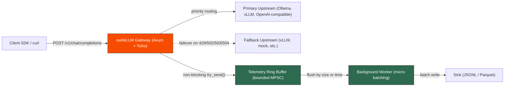

<div align="center">

# oxideLLM

**Evidence-first Rust gateway for OpenAI-compatible LLM streaming.**

Fast SSE pass-through, bounded async telemetry, micro-batched persistence, and multi-upstream failover in one local-first binary.

[](https://github.com/lugga1s/oxideLLM/actions/workflows/ci.yml)
[](LICENSE)
[](https://www.rust-lang.org)
[](Cargo.toml)

[Quick Start](#quick-start) | [Performance](#performance) | [Architecture](#architecture) | [Configuration](#configuration) | [Contributing](CONTRIBUTING.md) | [Validation Gates](docs/validation-gates.md) | [Benchmark Summary](benchmarks/alpha-v1-benchmark-summary.md)

</div>

---

## The Problem

Traditional LLM gateways couple **proxy**, **tracing**, **logging**, and **database writes** in the same synchronous request path. Under high concurrency, this turns the gateway into a serializing bottleneck:

| Path | Throughput | Efficiency | Degradation |
|---|---:|---:|---:|
| Direct to inference engine (vLLM) | ~16.0 req/s | 100% | - |
| Traditional gateway (4 workers + Postgres + Redis) | ~8.8 req/s | 55% | **-45%** |
| Traditional gateway (1 worker + Postgres + Redis) | ~3.9 req/s | 24% | **-75.6%** |

> Source: internal load tests with 500 concurrent requests against vLLM, documented in [.context/bottlenecks.md](.context/bottlenecks.md).

**oxideLLM** solves this by rigidly separating the data plane from telemetry: the task that owns the client socket **never waits** for disk I/O, log flushes, or database writes.

## Public Evidence Snapshot

oxideLLM is in alpha. The strongest published evidence today is local WSL2/localhost pass-through against the Rust SSE mock, plus CPU and heap profiling. That is useful architecture evidence, but it is not a claim of production parity with vLLM on bare metal.

| Evidence | Result | Status |
|---|---:|---|
| Stage 2 WSL2/local run, 1000 VUs, 30s | 20,919.35 req/s direct vs 18,118.36 req/s through oxideLLM; 13.39% degradation; P99 70.16 ms vs 92.47 ms | Green for the local/virtualized gate of <15% |
| Alpha v1 reconciled artifacts | 12.08% degradation with telemetry active; 11.18% with logs to `/dev/null`; older raw files did not record P99 | Yellow for broad public performance claims |
| WSL2 smoke run with `handleSummary()`, 100 VUs, 10s | 3.01% degradation; P99 48.66 ms direct vs 50.14 ms through oxideLLM | Functional evidence, not the full load gate |
| Stage 3/4 profiling | 0 heap allocations attributed to `src/stream.rs`; ~31.5 KB allocated/request; 1.77 context switches/request | Green for local CPU/heap profiling |

Claim boundary: the 1.01% number sometimes referenced in older context files compares two oxideLLM modes, not oxideLLM against the direct baseline. It is not used here as a public gateway-overhead claim.

---

## Architecture Positioning

| Concern | oxideLLM | Common interpreted gateway pattern |
|---|---|---|
| Runtime | Rust, Axum, Tokio | Python/Node.js/Lua runtime |
| Streaming path | Forward upstream chunks as bytes | Often parse or reshape token events |
| Telemetry path | Bounded `try_send` to a background worker | Often coupled to logging, tracing, or persistence |
| Persistence | Micro-batched after the response path | Often per-request or per-event writes |
| Public proof standard | Direct vs gateway artifacts are required | Varies by project |

## Key Highlights

- **OpenAI-compatible API** - integrate once, route to any supported provider.
- **Zero-copy SSE forwarding** - chunks are forwarded as raw byte streams, no per-token JSON deserialization.
- **Async telemetry off the critical path** - events are published to a bounded MPSC queue in microseconds; a background worker micro-batches and flushes to disk.
- **Multi-upstream failover** - if the primary provider fails (429/502/503/504 or network error), the gateway transparently retries on the next healthy upstream.
- **Active health checking** - a background worker periodically pings each upstream and removes unhealthy ones from the routing table.
- **Single binary, no runtime dependencies** - compiled Rust, no GC pauses, no interpreter overhead, no container runtime required.

---

## Performance

Benchmarked with [k6](https://k6.io) under **1000 virtual users** for **30 seconds** against a Rust SSE mock server on localhost under WSL2. The local/virtualized Stage 2 gate allows less than 15% degradation because WSL2 loopback adds measurable network overhead.

| Metric | Direct (baseline) | via oxideLLM | Overhead |
|---|---:|---:|---:|
| **Throughput** | 20,919 req/s | 18,118 req/s | 13.39% |
| **P95 latency** | 56.51 ms | 74.51 ms | +18 ms |
| **P99 latency** | 70.16 ms | 92.47 ms | +22 ms |
| **HTTP errors** | 0.00% | 0.00% | - |

Gate result: green for Stage 2 WSL2/local validation, not yet green for native vLLM parity. For the reconciled alpha summary, see [benchmarks/alpha-v1-benchmark-summary.md](benchmarks/alpha-v1-benchmark-summary.md).

### Deep Profiling (CPU & Memory Validation)

Traced under a concurrent load of **100 VUs** for **10 seconds** using Rust `dhat` (global heap allocator profiling) and Linux `perf stat` on WSL2:

- **Total Requests**: 21,777 requests successfully processed.
- **Average Throughput**: ~2,168 reqs/s.
- **CPU Context Switches**: **1.77 switches/request** (low in this local run, indicating no obvious lock contention in the measured path).
- **Heap Memory Footprint**: **~31.5 KB average per request** (stable residency, buffers fully deallocated upon stream termination).
- **Streaming Path Allocation Check**: DHAT heap profile found **0 allocations attributed to `src/stream.rs`**, supporting raw byte pass-through in the measured stream path.
- **Latency Distribution**: Average latency of **45.85 ms** vs. P99 of **48.65 ms** in the profiling run.

<details>
<summary><b>Environment & Reproducibility</b></summary>

```text
OS:     Linux 6.18 (WSL2 Ubuntu, ext4 filesystem)
CPU:    AMD Ryzen 5 5600G - 6 cores / 12 threads
Memory: 7.4 GiB
Rust:   rustc 1.96.0
k6:     v2.0.0 linux/amd64
Commit: 032d9285
```

**Reproduce it yourself:**

```bash
# Build release binaries
cargo build --release
cargo build --manifest-path mock/Cargo.toml --release

# Start mock server
./target/release/oxidellm-mock --host 127.0.0.1 --port 9000 &

# Start gateway
./target/release/oxidellm --host 127.0.0.1 --port 8080 \
  --upstream-base-url http://127.0.0.1:9000 &

# Baseline: direct to mock
k6 run -e VUS=1000 -e DURATION=30s \
  -e TARGET_URL=http://127.0.0.1:9000/v1/chat/completions \
  k6/proxy-vs-direct.js

# Gateway: through oxideLLM
k6 run -e VUS=1000 -e DURATION=30s \
  -e TARGET_URL=http://127.0.0.1:8080/v1/chat/completions \
  k6/proxy-vs-direct.js
```

Full methodology: [benchmarks/](benchmarks/) | Validation contract: [validation-gates.md](docs/validation-gates.md)

> **Note:** WSL2 loopback networking adds overhead due to Hyper-V bridge packet duplication. The current public claim remains the measured WSL2/local result above until a native or distributed direct-vs-gateway artifact is recorded.

</details>

---

## Architecture

oxideLLM separates three processing planes so that analytics never block the client response:



### Design Principles

| Principle | Implementation |
|---|---|
| **Critical path is minimal** | Accept -> route -> forward -> stream -> emit telemetry event (non-blocking) |
| **Zero-copy by default** | SSE chunks forwarded as `Bytes` (reference-counted, no content copy) |
| **Bounded telemetry queue** | `mpsc::channel` with fixed capacity; drops are counted, never block the client |
| **Micro-batched persistence** | Background worker flushes every 500ms or every 1000 events, whichever comes first |
| **Client disconnect = upstream cancel** | When the client drops the connection, the upstream stream is cancelled immediately |

---

## Supported Providers

| Provider family | Status | SSE Streaming | Failover | Default health check |
|---|---|---|---|---|
| **Mock Rust upstream** | Supported for local validation | Yes | Yes | `/healthz` |
| **Ollama** | Supported | Yes | Yes | `/api/tags` |
| **vLLM** | Supported as OpenAI-compatible pass-through | Yes | Yes | `/health` |
| **OpenAI-compatible HTTP APIs** | Supported by configurable `base_url` | Yes, when upstream supports it | Yes | Configurable |
| **Anthropic** | Planned | - | - | - |

> oxideLLM uses the **OpenAI chat completions format** as its canonical API. Any provider that exposes a `/v1/chat/completions`-compatible endpoint works out of the box.

---

## Configuration

Configuration is resolved with the following precedence:

1. **CLI arguments** (`--port`, `--upstream-base-url`, etc.)
2. **Environment variables** (`LLMK_PORT`, `LLMK_UPSTREAM_BASE_URL`, etc.)
3. **TOML config file** (`config.toml` in the project root)

### Example `config.toml`

```toml
[server]
host = "127.0.0.1"
port = 8080

[[upstreams]]
id = "primary"
provider = "ollama"
base_url = "http://127.0.0.1:11434"
priority = 1

[[upstreams]]
id = "fallback"
provider = "mock"
base_url = "http://127.0.0.1:9000"
priority = 2

[upstream_health]
interval_ms = 5000
timeout_ms = 1000

[telemetry]
capacity = 65536
log_path = "telemetry_events.jsonl"
batch_size = 1000
flush_interval_ms = 500
```

> More examples: [examples/](examples/) | Full parameter reference: [config.rs](src/config.rs)

### API Endpoints

| Method | Path | Description |
|---|---|---|
| `GET` | `/healthz` | Liveness probe |
| `GET` | `/readyz` | Readiness probe (telemetry status) |
| `GET` | `/analytics` | Request counters and telemetry stats |
| `POST` | `/v1/chat/completions` | OpenAI-compatible chat streaming |

---

## Resilience & Failover

oxideLLM implements enterprise-grade resilience through two coordinated mechanisms:

**1. Active Background Health Checking**
A background worker periodically pings each upstream's health endpoint. Unhealthy upstreams are removed from routing until they recover.

**2. Transparent Client-Side Failover**
When an upstream returns a retryable error (429, 502, 503, 504) or a network failure, the gateway automatically retries on the next healthy upstream - without interrupting the client's streaming connection.

<details>
<summary><b>Test failover yourself</b></summary>

```toml
# config.toml - simulate primary failure
[server]
host = "127.0.0.1"
port = 8080

[upstream_health]
interval_ms = 3000
timeout_ms = 1000

[[upstreams]]
id = "primary-dead"
provider = "mock"
base_url = "http://127.0.0.1:9000"   # Not running
priority = 1

[[upstreams]]
id = "fallback-alive"
provider = "mock"
base_url = "http://127.0.0.1:9001"   # Running
priority = 2
```

```bash
# Terminal 1: start only the fallback mock
cargo run --manifest-path mock/Cargo.toml -- --port 9001

# Terminal 2: start the gateway
cargo run

# Terminal 3: send a request
curl -N -X POST http://127.0.0.1:8080/v1/chat/completions \
  -H "Content-Type: application/json" \
  -d '{"model": "mock", "messages": [{"role": "user", "content": "test"}], "stream": true}'
```

The gateway will log `WARN upstream marked unhealthy upstream_id="primary-dead"` and transparently route to the fallback. When the primary recovers, you'll see `INFO upstream health restored`.

</details>

---

## Testing

```bash
# Full quality gate
cargo fmt --check
cargo check --all-targets
cargo test --all
cargo clippy --all-targets -- -D warnings
```

Tests cover: multi-upstream parsing, SSE parsing, proxy failover, health checking, telemetry overflow, body size limits, timeout enforcement, header filtering, model-based routing, and end-to-end integration.

---

## How oxideLLM is Different

| | oxideLLM | Traditional LLM Gateways |
|---|---|---|
| **Runtime** | Compiled Rust (no GC, no interpreter) | Python/Node.js (GC pauses, interpreter overhead) |
| **Telemetry** | Async, off critical path (bounded MPSC + micro-batching, zero blocking of client responses) | Synchronous logging, tracing, and DB writes per request |
| **P99 Latency Stability** | **Ultra-stable (P99 flat, delta of only 2.8 ms against average under load)** | Jittery (P99 spikes due to synchronous Telemetry/GC locks) |
| **SSE Handling** | Zero-copy byte stream forwarding | Per-token JSON parse -> object -> re-serialize |
| **In-Memory Heap Allocation** | No heap allocations attributed to `src/stream.rs` in the profiled stream path; ~31.5 KB allocated/request overall in the DHAT run | High allocation rate per token can occur when chunks are parsed into objects |
| **Database on Hot Path** | Never (by design invariant) | Often (Postgres/Redis per request) |
| **Deployment** | Single static binary | Python env + Postgres + Redis + workers |
| **Measured Overhead** | 13.39% on the 1000 VU WSL2/local Stage 2 run; 3.01% on the 100 VU smoke run | Up to 75.6% observed in the baseline bottleneck study |

> This is not a critique of specific projects - it's a comparison of **architectural patterns**. Run times with synchronous persistence are excellent for many use cases but create bottlenecks under high-concurrency LLM streaming workloads.

---

## Roadmap

- [x] **Stage 0** - Repository foundation, CI, Rust scaffold
- [x] **Stage 1** - Mock SSE server + baseline benchmarks
- [x] **Stage 2** - Proxy pass-through with bounded telemetry
- [x] **Stage 3** - Contention validation (`perf stat`, flamegraph)
- [x] **Stage 4** - Memory allocation profiling (`heaptrack`, DHAT)
- [x] **Stage 5** - Micro-batched async persistence
- [x] **Stage 7** - GitHub-ready (templates, CI, docs)
- [x] **Stage 8** - Multi-upstream failover + active health checking
- [ ] **Stage 6** - vLLM native parity benchmark (bare metal)
- [ ] **Future** - Prometheus `/metrics` endpoint
- [ ] **Future** - Rate limiting per tenant/route/model
- [ ] **Future** - Intelligent semantic/cost-based routing
- [ ] **Future** - Multi-stage Dockerfile + pre-built release binaries

---

## Sponsors

oxideLLM is **100% free and open-source**. If the gateway reduces your infrastructure costs and downtime, consider supporting voluntary development:

<div align="center">

[**GitHub Sponsors**](https://github.com/sponsors/lugga1s) | [**Buy Me a Coffee**](https://www.buymeacoffee.com/lugga1s)

</div>

---

## License

**AGPL-3.0-or-later** - see [LICENSE](LICENSE) for full text and [licensing-strategy.md](docs/licensing-strategy.md) for the commercial open-source policy.

---

## Contributing

Contributions are welcome! Please read the [Contributing Guide](CONTRIBUTING.md) and [Security Policy](SECURITY.md) before submitting changes.

**Quick checklist:** `cargo fmt` | `cargo check` | `cargo test` | `cargo clippy` | no secrets committed.

---

## Project Context & Runbooks

These strategic engineering manuals and operational runbooks are designed to keep the development lifecycle aligned between humans and agentic workflows.

### Strategic Context (`.context/`)

- [Project Manifest](.context/project-manifest.md) - Project mission, core values, architectural tenets, and target gates.
- [Bottlenecks Registry](.context/bottlenecks.md) - Traced bottlenecks in legacy gateways and target performance improvements.
- [Competitive Analysis](.context/competitive-analysis.md) - In-depth breakdown of oxideLLM vs. LiteLLM, Kong, and Portkey.
- [Product Roadmap](.context/roadmap.md) - Strategic development horizon from MVP to Beta releases.
- [Marketing & GTM Strategy](.context/marketing-launch-plan.md) - Go-To-Market strategy, distribution channels, and messaging.
- [GTM Launch Copy](.context/GTM-launch-copy.md) - Pre-drafted launch threads and posts for Hacker News, Reddit, and X/Twitter.

### Execution & Hardening Manuals (`docs/`)

- [Implementation Playbook](docs/implementation-playbook.md) - Operational play-by-play for all coding and validation sessions.
- [Validation Gates Contract](docs/validation-gates.md) - Strict performance and error rate thresholds required for each stage.
- [Agent Quality Scorecard](docs/agent-quality-scorecard.md) - Evaluation criteria and scoring weights for agent executions.
- [Production Ritual](docs/production-ritual.md) - Hardening, pre-flight checks, and deployment guidelines.
- [Tooling Setup Guide](docs/tooling-setup.md) - Installation runbook for Rust, k6, Docker, and WSL2 environments.
- [Architecture Blueprint](docs/architecture.md) - Detailed layout of data, control, and telemetry planes.
- [Multi-Agent Handoff](docs/multi-agent-handoff.md) - Guidelines for structured agent handoffs.

### Benchmarking & Profiling (`benchmarks/`)

- [vLLM Parity Runbook](benchmarks/vllm-parity-runbook.md) - Step-by-step benchmark execution protocol for comparing against vLLM.
- [DHAT Profiling Report](benchmarks/results/dhat-profiling-report.md) - Empirical profiling notes for heap usage and context switches.
- [Alpha v1 Benchmark Summary](benchmarks/alpha-v1-benchmark-summary.md) - Comprehensive summary of the initial load testing results.
